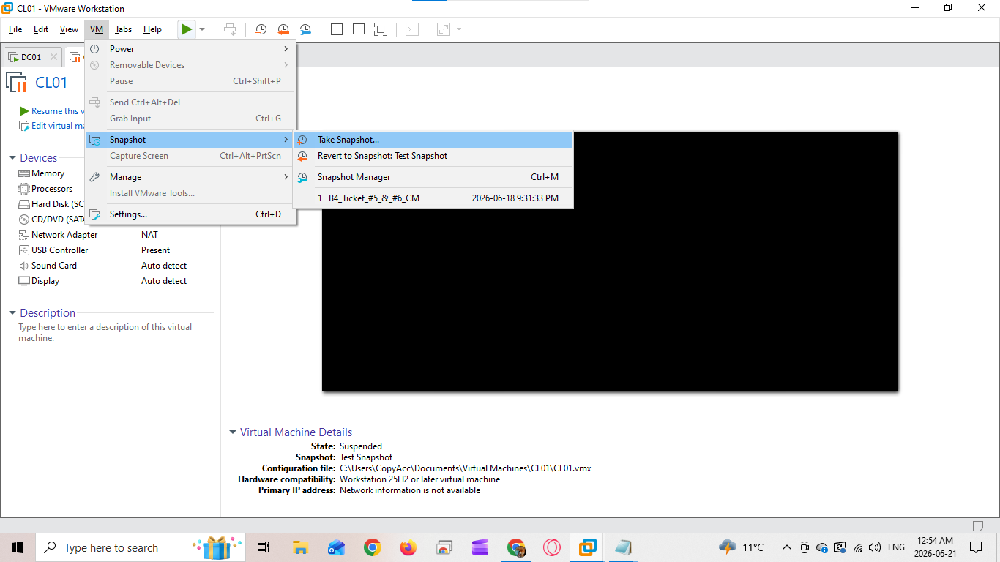
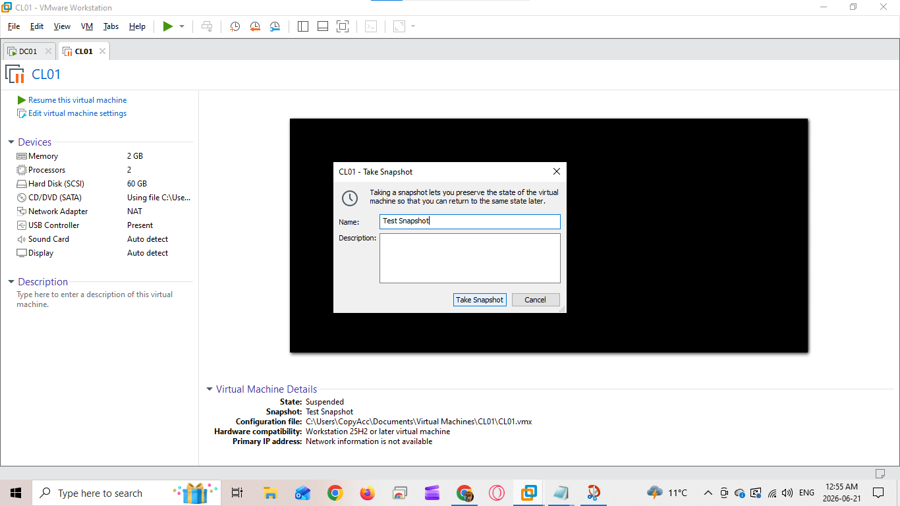
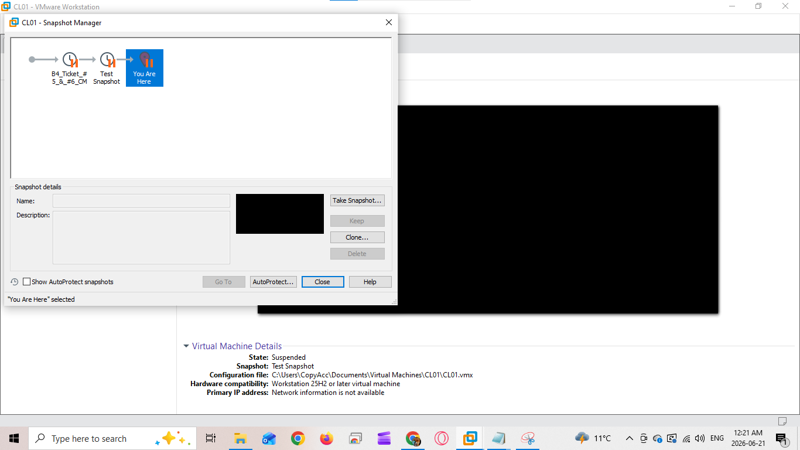

# Creating a Snapshot For VMWare Workstation</strong>

## Purpose 
This document provides guidance to create a Snapshot on VMWare Workstation

## Tools and Software Needed 
• VMWare Workstation

## Environment
VMWare Workstation

### Create a snapshot before making significant changes to a virtual machine, such as:
* Installing software
* Applying Windows Updates
* Modifying Active Directory
* Testing configurations
* Troubleshooting

## Steps:

1. Open VMWare Workstation and the specific Virtual Machine needed to be preserved

2. Select VM > Snapshot > Take Snapshot.

3. In the dialogue window that comes up enter your snapshot name and click "Take Snapshot"

## Verification 
* The snapshot appears in Snapshot Manager.
* The snapshot name is correct.
* The snapshot can be selected for future restoration if needed.

## Best Practices
* Use descriptive snapshot names (e.g., "Before Domain Join").
* Avoid creating excessive snapshots, as they consume disk space.
* Delete snapshots that are no longer needed.
* Do not rely on snapshots as a replacement for regular backups.
