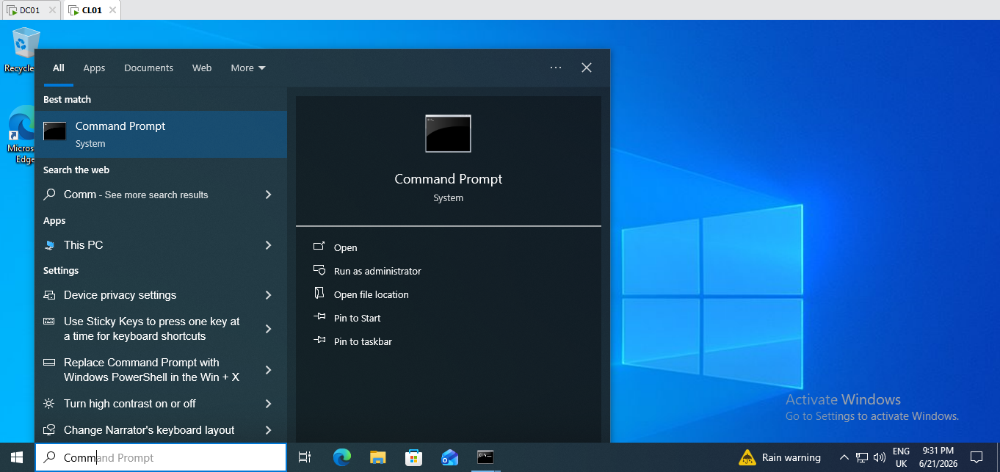
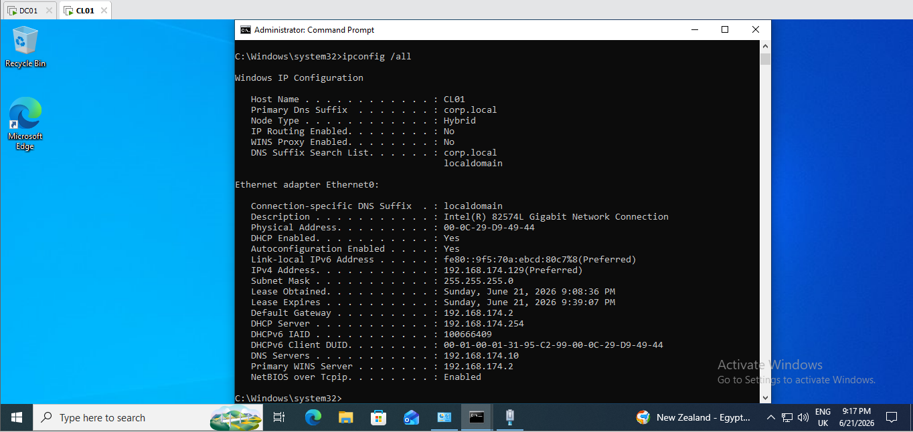
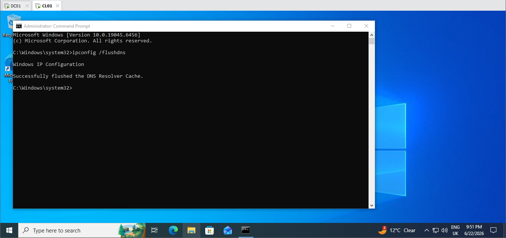
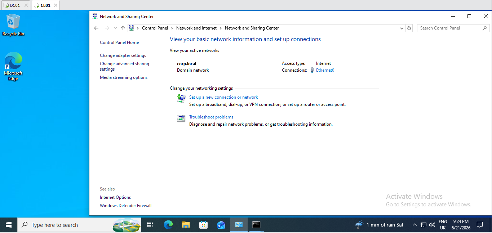
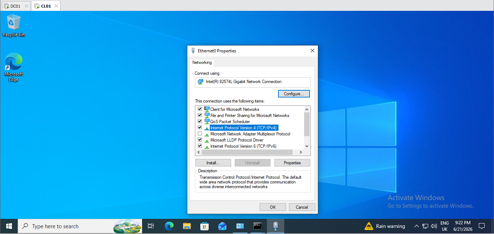
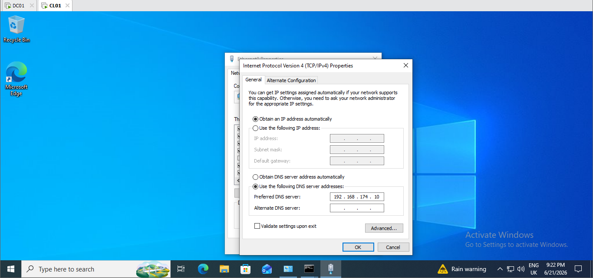
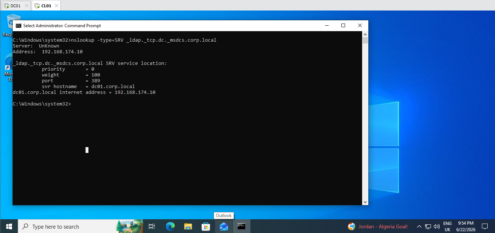

# Domain Join Troubleshooting</strong>

## Purpose

This document provides the procedure for verifying and correcting client configuration issues that prevent a Windows workstation from joining an Active Directory domain.

## Tools and Software Needed

* Windows Server 2022
* Windows 10 Pro Client
* Command Prompt (Administrator)
* Control Panel

## Prerequisites

* Administrative credentials
* Access to the client workstation
* Domain Controller is powered on and operational
* The correct DNS server IP address is available
* Network connectivity between the client and Domain Controller

## Symptoms

* "An Active Directory Domain Controller for the domain could not be contacted."
* Unable to join the domain.
* Domain authentication fails.
* Network path not found.
* Unable to locate the Domain Controller.

## Environment

* **Domain Controller:** Windows Server 2022
* **Client:** Windows 10 Pro
* **Domain:** corp.local

## Possible Causes

* Incorrect DNS server configuration
* Domain Controller is offline
* Network connectivity issues
* Windows Firewall or other firewall restrictions
* Time synchronization issues between the client and Domain Controller
* Incorrect domain name entered during the join process

## Resolution

1. Open **Command Prompt** as an Administrator.

2. Run `ipconfig /all` to verify the current IP configuration and DNS server address.

3. Run `nslookup corp.local` to verify that the domain name resolves successfully.

4. Run `ipconfig /flushdns` to clear the local DNS cache if necessary.

5. Open **Control Panel** and navigate to **Network and Internet > Network and Sharing Center**.

6. Select the active **Ethernet** connection.
7. Select **Properties**.

8. Double-click **Internet Protocol Version 4 (TCP/IPv4)**.

9. Verify that **Use the following DNS server addresses** is selected.

10. Enter the IP address of the Domain Controller's DNS server if corrections are required.
11. Select **OK** to save the changes.
12. Run `ipconfig /flushdns` again.

13. Run `nslookup -type=SRV _ldap._tcp.dc._msdcs.corp.local` to verify that the Domain Controller's LDAP service records can be located.

14. Run `ping dc01` and `ping corp.local` to verify basic network connectivity and name resolution.
15. Attempt to join the workstation to the domain again.

#### Refer to **HDD-005** for the Domain Join demonstration.
#### Refer to **HDD-006** for additional DNS troubleshooting guidance.

## Verification

* The workstation successfully joins the domain.
* The computer account appears in Active Directory.
* The workstation can authenticate using a domain account.
* The Domain Controller is reachable using DNS name resolution.

## Lessons Learned

* Verify DNS configuration before attempting to join a domain.
* Use `ipconfig /all` to confirm the configured DNS server.
* Use `nslookup` to verify DNS name resolution.
* Use `nslookup -type=SRV` to verify that Active Directory service records are registered and discoverable.
* Active Directory relies on DNS to locate Domain Controllers and authentication services.
  
